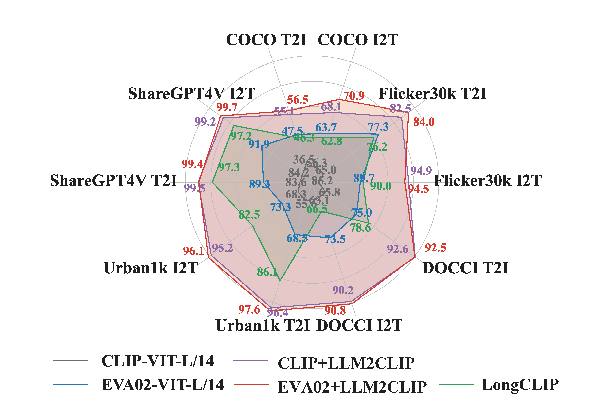
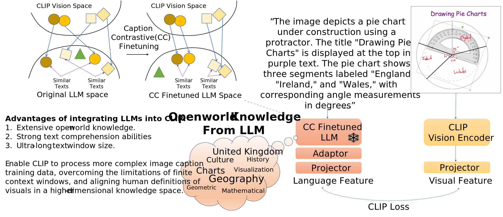

Sure! Here’s an enhanced version of the **LLM2CLIP** project documentation that incorporates innovations and improvements while maintaining clarity and structure.

---

# LLM2CLIP: Powerful Language Model Unlocks Richer Visual Representation

Welcome to the official repository for **LLM2CLIP**! This project leverages large language models (LLMs) as powerful textual teachers for CLIP's visual encoder, enabling more nuanced and comprehensive multimodal learning.

[](https://arxiv.org/abs/2411.04997) [](https://aka.ms/llm2clip) [](https://huggingface.co/collections/microsoft/llm2clip-672323a266173cfa40b32d4c)  
**Paper:** Accepted to NeurIPS 2024 Workshop: Self-Supervised Learning - Theory and Practice

---

## News 🚀🚀🚀
- **[2024-11-18]** Our Caption-Contrastive finetuned Llama3-8B-CC released on [HuggingFace](https://huggingface.co/microsoft/LLM2CLIP-Llama-3-8B-Instruct-CC-Finetuned). More versions will follow!
- **[2024-11-08]** We are currently training a **scaled-up** version with ten times the training dataset, alongside upcoming updates: EVA ViT-E, InternVL-300M, SigCLIP-SO-400M, and more VLLM results trained with LLM2CLIP. Stay tuned for the most powerful CLIP models, and thank you for your support!
- **[2024-11-06]** OpenAI's CLIP and EVA02's ViT base and large models are now available on [HuggingFace](https://huggingface.co/collections/microsoft/llm2clip-672323a266173cfa40b32d4c).
- **[2024-11-01]** Our paper was accepted to the NeurIPS 2024 SSL Workshop!

---



## Challenges with Existing CLIP

Current versions of CLIP face several limitations:

- **Limited Context Window**: The text encoder has a short context window of only 77 tokens, which restricts its understanding of lengthy inputs.
- **Weak Text Comprehension**: The text encoder often functions as a bag-of-words model with limited depth, hindering its ability to comprehend complex text.

## Why Integrate LLM with CLIP?

LLM2CLIP brings the unimaginable power of large language models to CLIP, even surpassing native language capabilities. Our LLM2CLIP, fine-tuned purely on an English corpus, outperforms standard Chinese CLIP models:

1. **Extended Input Window**: The LLM expands CLIP's input window, allowing richer textual context and better comprehension of long inputs.
2. **Enhanced Understanding**: With LLM's help, CLIP gains a deeper understanding of dense, complex captions, leading to improved text-image alignment.
3. **Open-World Knowledge**: The LLM provides open-world knowledge, enabling more globally informed multimodal feature alignment and boosting training efficiency.

## Key Challenges

While LLMs have strong inherent text encoding capabilities, the output space is often not highly separable, which limits their effectiveness for contrastive learning.


## Our Approach

To overcome these challenges, we designed a **Caption-to-Caption Contrastive Learning** strategy. We trained the LLM to better differentiate between captions of the same or different images, enhancing the separability of the LLM's output space. During training, the LLM gradients were frozen while CLIP's visual encoder was fine-tuned on limited data, resulting in significant performance gains.

Through this strategy, we better utilized the LLM's power to comprehend and process **long and dense captions**, improving overall representation capabilities.

## What Can You Achieve with LLM2CLIP?

1. **Enhanced CLIP Models**: Fine-tune pretrained CLIP models with dense captions or task-specific image-text datasets, making CLIP stronger for various use cases.
2. **Out-of-the-Box Power**: Directly use our enhanced CLIP models, significantly upgraded with LLM guidance for superior performance in multimodal tasks.
3. **Cross-Modal Applications**: Explore new applications in domains such as medicine, law, and education, where nuanced understanding of language and visuals is critical.

---



## Model Zoo (Continuously Updated)

Stay tuned for updates on pretrained models and datasets, which will be made available in the [HuggingFace Model Zoo](https://huggingface.co/collections/microsoft/llm2clip-672323a266173cfa40b32d4c).

---

## 💻 Installation Guide

1. **Create the environment**:

   ```bash
   conda create -n llm2clip python=3.8
   conda activate llm2clip
   pip install -r requirements.txt
   ```

2. **Data Preparation**:

   *(Coming Soon)*

3. **🔥 Training**:

   ```bash
   sh run.sh
   ```

# 📚 FAQ
For more insights and answers, visit our [FAQ](FAQ.md).

## Q1:

> **Q: It is foreseeable that the technology of LLM2CLIP will be of great significance in expanding CLIP's support for more modal data. What additional challenges will arise, for example, the feature space alignment problem of high-dimensional modalities?**

>  **A:** We’re already exploring a video-based version of LLM2CLIP, including scaling up both the dataset size and model parameters significantly. Here are some challenges:
>
> 1. **Enhancing the Supervisory Signal in Contrastive Learning:** We could enrich inputs with denser captions or instructions, providing more complex information for the LLM to interpret.
> 
> 2. **Expanding Contrastive Learning Loss Across Dimensions:** Designing prompts to guide the training process in additional dimensions, such as the temporal dimension in video data.
>
> 3. **Tackling Complex Temporal Logic in Videos:** Incorporating self-play techniques using the LLM to introduce tasks and increase training objective complexity.

## Q2:

> **Q: What are the potential applications of LLM2CLIP in specialized domains, such as medicine or law?**

>  **A:** We see significant potential in specialized fields:
>
> 1. **Limited Data, High Impact:** Fine-tuning with limited domain-specific data could resolve issues like perception or cognition hallucinations.
> 
> 2. **Leveraging LLM Knowledge as Data Augmentation:** The knowledge encoded in LLMs can serve as an excellent data augmenter in fields like medical reports, where data is often scarce.
>
> We look forward to collaborating to push the boundaries of multimodal domains!

## Q3:

> **Q: How are the loss functions and datasets integrated during the fine-tuning process?**

>  **A:** 
> 
> **Loss Functions Integration:** We use supervised SimCSE loss for positive and negative samples, followed by Masked Next Token Prediction (MNTP) as an earlier training stage. MNTP has minimal impact on results, but we still use it for optimal performance.
> 
> **Dataset Combination:** We mix pure text (Wikitext-103) and caption datasets (CC-3M) to retain the LLM's original distribution. We shuffle and sample batches normally for training.
>
> If you have more questions, please feel free to ask.

## ❤️ Acknowledgements

Our code is built on top of [EVA-CLIP](https://github.com/baaivision/EVA/tree/master/EVA-CLIP). We would like to thank the EVA team for their foundational work.

## Citation

If you use our work, please cite:

```
@misc{huang2024llm2clippowerfullanguagemodel,
      title={LLM2CLIP: Powerful Language Model Unlock Richer Visual Representation}, 
      author={Weiquan Huang and Aoqi Wu and Yifan Yang and Xufang Luo and Yuqing Yang and Liang Hu and Qi Dai and Xiyang Dai and Dongdong Chen and Chong Luo and Lili Qiu},
      year={2024},
      eprint={2411.04997},
      archivePrefix={arXiv},
      primaryClass={cs.CV},
      url={https://arxiv.org/abs/2411.04997}, 
}
```

---

This enhanced documentation emphasizes the innovations and potential applications of LLM2CLIP, making it clear how this project advances the capabilities of CLIP through the integration of large language models.
